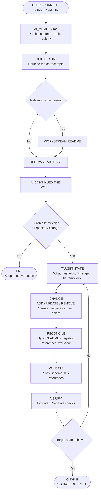

# Second-Brain

## Purpose

This repository is a provider-independent AI working-context layer.

The goal is simple: let a new AI read the user's durable working knowledge from GitHub and continue the relevant topic without requiring the user to re-explain established context.

This is **not** a conversation archive, a personal knowledge-management platform, or a knowledge graph.

## How it works

The system has two simple loops: **read the right context → do the work**, then **write back only what is durable → verify the repository**.



### The flow in one line

`Conversation → AI_MEMORY → Topic README → Workstream → Artifact → Work → Target State → Change → Reconcile → Validate → Verify → GitHub`

The key rule is:

**The final repository state defines completion — not the fact that an AI tool action succeeded.**

Operating principle:

`Conversation / Source → Knowledge → Routing → Continuation`

Repository maintenance principle:

`Final repository state > tool actions`

## Core control documents

| Document | Role |
|---|---|
| `AI_MEMORY.md` | Global durable context + canonical active-topic registry |
| `WORKFLOW.md` | Operating lifecycle, routing, templates, maintenance rules |
| `REPOSITORY_CONTRACT.md` | Repository invariants + source-of-truth + completion contract |
| `TOPICS/SYSTEMS/User_Prompts.md` | Reusable prompts for user-side reinforcement across topics |
| `TOPICS/SYSTEMS/Second_Brain_Operations.md` | Compact operational execution guide |
| `scripts/validate_second_brain.py` | Executable repository validation |
| `.github/workflows/validate.yml` | Automatic validation on `main` pushes and pull requests |
| `.github/ISSUE_TEMPLATE/change_request.yml` | Structured change-request form |

## GitHub platform controls

Second-Brain uses four complementary GitHub-native controls:

1. **GitHub Actions** — automated repository validation.
2. **Issue Forms** — standardized change-request input when structured requirements are useful.
3. **Task Lists** — explicit execution/completion checklists for multi-step work.
4. **Mermaid** — visual presentation of workflows, architecture, relationships, and process where it improves understanding.

These controls do not replace the Markdown source of truth. Canonical rules remain in `WORKFLOW.md` and `REPOSITORY_CONTRACT.md`.

## Repository structure

The structure remains intentionally small:

```text
AI_MEMORY.md                  ← global memory + canonical topic registry
WORKFLOW.md                   ← workflow + templates + lifecycle
REPOSITORY_CONTRACT.md        ← invariants + completion contract
TOPICS/
└── <topic>/
    ├── README.md             ← topic entry point
    └── <workstream/files>    ← detailed recurring work when needed
.github/
├── workflows/                ← automated validation
└── ISSUE_TEMPLATE/           ← structured change requests
scripts/                      ← validation tooling
```

The active topic list is maintained only in `AI_MEMORY.md`. The root README does not duplicate the active-topic registry.

## Standard topic README

Every topic folder has one canonical topic entry point:

`TOPICS/<topic>/README.md`

All topic READMEs use the same eight core sections defined in `WORKFLOW.md`:

1. Scope
2. Current Context
3. Working Principles
4. Active Projects / References
5. Decisions
6. Lessons
7. Routing
8. Next

Topic-specific sections may be inserted when useful.

Recurring non-trivial child areas may use a workstream README, but not every folder needs a README purely for symmetry.

## Onboarding a new AI

1. Read `AI_MEMORY.md`.
2. Identify the relevant topic.
3. Read the topic `README.md`.
4. Read the relevant workstream README when one exists.
5. For repository maintenance or structural changes, read `WORKFLOW.md` and `REPOSITORY_CONTRACT.md`.
6. Read only the artifacts needed for the current task.
7. Combine repository knowledge with current conversation context; current explicit user information takes precedence.
8. Use Handoff only as temporary continuation state.
9. Before reporting a repository change as complete, verify the actual final GitHub state.
10. When a change is multi-step, use the Issue Form/Task List controls when they provide useful traceability.

## Memory maintenance

A conversation is not automatically memory.

Promote information only when it is durable and useful beyond the current task. Before updating memory, classify the change as **ADD / UPDATE / REMOVE / NO_CHANGE**.

Update the smallest correct scope and avoid duplicate authoritative representations.

For repository mutations, follow:

`READ → ROUTE → INSPECT → TARGET STATE → CHANGE → RECONCILE → VALIDATE → VERIFY → REPORT`

## Reliability model

The system uses five complementary controls:

1. **Canonical rules** — `WORKFLOW.md`.
2. **Repository invariants** — `REPOSITORY_CONTRACT.md`.
3. **User reinforcement prompts** — `TOPICS/SYSTEMS/User_Prompts.md`.
4. **Executable validation** — `scripts/validate_second_brain.py` + GitHub Actions.
5. **Structured execution** — Issue Forms + Task Lists when useful.

A tool action succeeding is not completion evidence. The final repository state is.

## Scope boundary

Keep the system deliberately small. Do not add Obsidian, a knowledge graph, vector database, RAG layer, automatic ingestion of all conversations, or other infrastructure unless repeated real usage demonstrates that the simpler GitHub-based workflow is insufficient.

Git history already provides historical versions. Detailed project knowledge stays in its authoritative project source unless the project has explicitly been migrated into Second-Brain.
