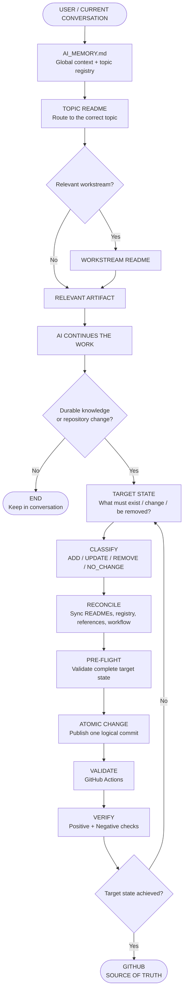

# Second-Brain

## Purpose

This repository is a provider-independent AI working-context layer.

The goal is simple: let a new AI read the user's durable working knowledge from GitHub and continue the relevant topic without requiring the user to re-explain established context.

This is **not** a conversation archive, a personal knowledge-management platform, or a knowledge graph.

## How it works

The system has two simple loops: **read the right context → do the work**, then **write back only what is durable → verify the repository**.


```mermaid
flowchart TD
    A([USER / CURRENT CONVERSATION]) --> B[AI_MEMORY.md<br/>Global context + topic registry]
    B --> C[TOPIC README<br/>Route to the correct topic]
    C --> D{Relevant workstream?}
    D -- Yes --> E[WORKSTREAM README]
    D -- No --> F[RELEVANT ARTIFACT]
    E --> F
    F --> G[AI CONTINUES THE WORK]
    G --> H{Durable knowledge<br/>or repository change?}
    H -- No --> I([END<br/>Keep in conversation])
    H -- Yes --> J[TARGET STATE<br/>What must exist / change / be removed?]
    J --> K[CLASSIFY<br/>ADD / UPDATE / REMOVE / NO_CHANGE]
    K --> L[RECONCILE<br/>Sync READMEs, registry, references, workflow]
    L --> M[PRE-FLIGHT<br/>Validate complete target state]
    M --> N[ATOMIC CHANGE<br/>Publish one logical commit]
    N --> O[VALIDATE<br/>GitHub Actions]
    O --> P[VERIFY<br/>Positive + Negative checks]
    P --> Q{Target state achieved?}
    Q -- No --> J
    Q -- Yes --> R([GITHUB<br/>SOURCE OF TRUTH])
```

### The flow in one line

`Conversation → AI_MEMORY → Topic README → Workstream → Artifact → Work → Target State → Change → Reconcile → Validate → Verify → GitHub`

The key rule is:

**The final repository state defines completion — not the fact that an AI tool action succeeded.**

Operating principle:

`Conversation / Source → Knowledge → Routing → Continuation`

Repository maintenance principle:

`Final repository state > tool actions`

## Architecture model

Second-Brain uses a lightweight Capability layer only for active operational topics.

```text
Knowledge → Workflow → Capability → Execution Contract → Tool / AI
→ Staging / Output → Validation → Human Verification → Promote / Commit
→ GitHub Source of Truth
```

Current operational domains:
- CAREER: three topic capabilities under `B. CAREER/1. CAPABILITIES/` with one consolidated weekly report.
- R&D INNOVATION: five reusable capabilities, three workstreams, and one authoritative Knowledge Sheet.
- AI GENERAL, NUVIO SETUP, and R&D DATABASE remain storage/archive or project-source contexts.

`SYSTEM CORE/` is repository-level infrastructure outside `TOPICS/` and contains canonical controls plus reusable cross-topic capabilities.

Staging is intermediate/unvalidated state, not source of truth. Conflicting authoritative information must not be silently overwritten.

## Core control documents

| Document | Role |
|---|---|
| `AI_MEMORY.md` | Global durable context + canonical topic registry and lifecycle status |
| `SYSTEM CORE/WORKFLOW.md` | Operating lifecycle, routing, templates, maintenance rules |
| `SYSTEM CORE/REPOSITORY_CONTRACT.md` | Repository invariants + source-of-truth + completion contract |
| `SYSTEM CORE/User_Prompts.md` | Reusable prompts for user-side reinforcement across topics |
| `SYSTEM CORE/Second_Brain_Operations.md` | Compact operational execution guide |
| `scripts/validate_second_brain.py` | Executable repository validation |
| `.github/workflows/validate.yml` | Automatic validation on `main` pushes and pull requests |
| `.github/ISSUE_TEMPLATE/change_request.yml` | Structured change-request form |

## GitHub platform controls

Second-Brain uses four complementary GitHub-native controls:

1. **GitHub Actions** — automated repository validation.
2. **Issue Forms** — standardized change-request input when structured requirements are useful.
3. **Task Lists** — explicit execution/completion checklists for multi-step work.
4. **Mermaid** — visual presentation of workflows, architecture, relationships, and process where it improves understanding.

AI Semantic Review is a separate ChatGPT-assisted PR review layer, not a GitHub Action.

These controls do not replace the Markdown source of truth. Canonical rules remain in `SYSTEM CORE/WORKFLOW.md` and `SYSTEM CORE/REPOSITORY_CONTRACT.md`.

## Repository structure

The structure remains intentionally small:

```text
AI_MEMORY.md                  ← global memory + canonical topic registry
SYSTEM CORE/WORKFLOW.md                   ← workflow + templates + lifecycle
SYSTEM CORE/REPOSITORY_CONTRACT.md        ← invariants + completion contract
TOPICS/
├── 1. <topic>/
│   ├── README.md             ← topic entry point
│   └── <workstream/files>    ← detailed recurring work when needed
├── 2. <topic>/
│   └── ...
└── N. <topic>/
    └── ...
.github/
├── workflows/                ← automated validation
└── ISSUE_TEMPLATE/           ← structured change requests
scripts/                      ← validation tooling
```

The topic registry and lifecycle state are maintained in `AI_MEMORY.md`; each topic README carries the detailed status summary and direction. The root README does not duplicate the topic registry.

## Standard topic README

Every topic folder has one canonical topic entry point:

`TOPICS/<topic>/README.md`

All topic READMEs use the same nine core sections defined in `SYSTEM CORE/WORKFLOW.md`:

1. Scope
2. Current Context
3. Status
4. Working Principles
5. Active Projects / References
6. Decisions
7. Lessons
8. Routing
9. Next

Topic-specific sections may be inserted when useful.

Recurring non-trivial child areas may use a workstream README, but not every folder needs a README purely for symmetry.

## Onboarding a new AI

1. Read `AI_MEMORY.md`.
2. Identify the relevant topic.
3. Read the topic `README.md`.
4. Read the relevant workstream README when one exists.
5. For repository maintenance or structural changes, read `SYSTEM CORE/WORKFLOW.md` and `SYSTEM CORE/REPOSITORY_CONTRACT.md`.
6. Read only the artifacts needed for the current task.
7. Combine repository knowledge with current conversation context; current explicit user information takes precedence.
8. Use Handoff only as temporary continuation state.
9. Before reporting a repository change as complete, verify the actual final GitHub state.
10. When a change is multi-step, use the Issue Form/Task List controls when they provide useful traceability.

## Memory maintenance

A conversation is not automatically memory.

Promote information only when it is durable and useful beyond the current task. Before updating memory, classify the change as **ADD / UPDATE / REMOVE / NO_CHANGE**.

Update the smallest correct scope and avoid duplicate authoritative representations.

For repository mutations, follow:

`READ → ROUTE → INSPECT → TARGET STATE → CLASSIFY → RECONCILE → PRE-FLIGHT → ATOMIC CHANGE → VALIDATE → VERIFY → REPORT`

## Reliability model

The system uses five complementary controls:

1. **Canonical rules** — `SYSTEM CORE/WORKFLOW.md`.
2. **Repository invariants** — `SYSTEM CORE/REPOSITORY_CONTRACT.md`.
3. **User reinforcement prompts** — `SYSTEM CORE/User_Prompts.md`.
4. **Executable validation** — `scripts/validate_second_brain.py` + GitHub Actions.
5. **Structured execution** — Issue Forms + Task Lists when useful.

A tool action succeeding is not completion evidence. The final repository state is.

## AI Semantic Review

For PRs that need semantic review, use ChatGPT through the GitHub repository connection to review the PR diff against `AI_MEMORY.md`, `SYSTEM CORE/WORKFLOW.md`, `SYSTEM CORE/REPOSITORY_CONTRACT.md`, and the affected topic/source files. Focus on target-state completeness, synchronization, cleanup, contract alignment, and semantic gaps that deterministic validation may miss.

This review is advisory. It does not require an OpenAI API key and does not replace GitHub Actions validation or final repository verification.

## Scope boundary

Keep the system deliberately small. Atomic publication is a reliability rule, not additional infrastructure. Do not add Obsidian, a knowledge graph, vector database, RAG layer, automatic ingestion of all conversations, or other infrastructure unless repeated real usage demonstrates that the simpler GitHub-based workflow is insufficient.

Git history already provides historical versions. Detailed project knowledge stays in its authoritative project source unless the project has explicitly been migrated into Second-Brain.


## Topic Navigation Order

The topic folders use numeric prefixes in canonical workflow/navigation order:

1. `TOPICS/A. AI GENERAL/`
2. `TOPICS/B. CAREER/`
3. `TOPICS/C. NUVIO SETUP/`
5. `TOPICS/D. RnD DATABASE/`
6. `TOPICS/E. RnD INNOVATION/`
7. `SYSTEM CORE/`

Ordered child workstream folders use the same convention when their routing/workflow sequence is meaningful. Supporting artifact folders remain unnumbered.

## R&D Innovation execution model

Discovery uses PERSONAL_RESEARCH and CLAW_DISCOVERY. Evaluation uses IDEA_REVIEW, EVALUATE, and DEEP_ANALYZE. KNOWLEDGE_PROMOTION controls entry into the authoritative Knowledge Sheet.

The existing R&D workstream structure remains the routing layer; no generic capability directory is introduced.