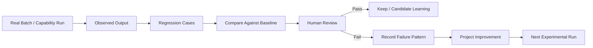

# R&D Innovation Regression

## Purpose

Provide a lightweight, repeatable evaluation layer for real R&D capability executions.

This is a regression/evaluation contract, not a second workflow, database, scoring engine, or autonomous evaluator.

## What it verifies

Regression checks whether real outputs preserve the current R&D baseline across five dimensions:

1. Routing — the execution uses the correct capability/prompt path.
2. Evidence — consequential claims remain traceable and evidence state is explicit.
3. Discovery quality — technology, technical enabler, product capability, and standalone idea are not conflated.
4. State / promotion — staging remains non-authoritative and human verification remains required before promotion.
5. Output contract — required fields, dispositions, classifications, and uncertainty are preserved.

## Execution model

Regression is performed on real outputs. The repository validator checks the regression contract and artifact structure, but it does not claim that an AI-generated R&D result is semantically good merely because the repository validator passes.

## Canonical artifacts

- `CASES.md` — recurring, material regression cases and expected behavior.
- `RUN_TEMPLATE.md` — standard record for evaluating a real batch/run.
- `BASELINE.md` — current comparison baseline and known limitations.

## Current baseline

Batches `2026-09-20_to_2026-09-22` and `2026-09-23_to_2026-09-25` are the current observed baseline inputs.

Batch #2 introduced explicit `Candidate_Class`, `Quality_Gate_Result`, and `Quality_Gate_Reason` fields. This makes the second batch more directly evaluable against the Discovery Quality Gate than Batch #1.

No claim that Batch #2 is objectively better is made here. The schemas and learning rules changed between the batches, so a controlled quality-improvement conclusion requires subsequent comparable runs.

## Run rule

For each real evaluation run:

1. Identify the exact capability/prompt and batch being evaluated.
2. Use the cases in `CASES.md`.
3. Record only observations supported by the actual output.
4. Separate mechanical checks from human semantic judgment.
5. Record recurring/material failures.
6. Propose a rule or prompt change only when the failure is sufficiently demonstrated.
7. Do not promote the change automatically.

## Promotion rule

`Observe → Identify Gap → Propose Change → Test → Human Verify → Promote`

A regression result does not itself modify the R&D baseline.

## Scope boundary

Do not add:

- a generic Skill Engine;
- a generic Capability Engine;
- a second scheduler;
- a separate evaluation service;
- a vector/graph/RAG layer;
- autonomous baseline promotion.

If the existing Markdown + Git history + validator + human review model becomes insufficient, document the demonstrated failure first in Project Improvement.
