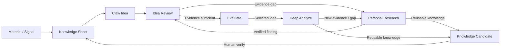

# R&D Innovation

## Scope

R&D engineering, innovation research, technology scouting, competitor/supplier technology, patents, mechanisms, idea generation, evaluation, and related workflows for bathroom, shower, faucet, and adjacent mechanical products.

## Current Context

The topic uses an evidence-driven flow:

`Material → Knowledge Sheet → Claw Idea → Idea Review → Evaluate → Deep Analyze`

The project also improves its own prompts, workflows, tool selection, workstream design, and validation through Project Improvement & Governance under `Personal Research/`.

## Status

- State: Active
- Summary: R&D innovation capability is organized into Personal Research, Knowledge Sheet + Claw, Idea Review, and the maintainer Project Improvement capability.
- Direction: Keep research evidence traceable, minimize repeated work, and improve the system from observed results rather than adding complexity by default.
- Last reviewed: 2026-09-19

## Working Principles

- Prefer primary, technical, and directly relevant evidence.
- Distinguish evidence, inference, assumption, proposal, and unknown.
- Existing Knowledge Sheet relationships are facts only when supported by current source data.
- Semantic candidate connections are useful for discovery but are not automatically written back as relationships.
- Absence from the Knowledge Sheet or search results is not proof of novelty.
- Research only to the depth needed for the decision.
- Do not duplicate detailed knowledge unnecessarily.
- Human verification is required before promoting a Knowledge Candidate into the authoritative Knowledge Sheet.

## Active Workstreams

| Workstream | Purpose | Primary tools |
|---|---|---|
| `Knowledge sheet/` | Structured reusable knowledge, evidence, IDs, and relationships. | ChatGPT Project + Web + GitHub; NotebookLM for team use |
| `Personal Research/` | Personal engineering research, external investigation, and maintainer project improvement/governance. | ChatGPT Project + Web + GitHub |
| `Idea Review/` | Evidence-based review and development of existing ideas. | NotebookLM + Custom Gemini + released Prompt.csv |

Project Improvement is a maintainer capability under `Personal Research/Project Improvement/`, not a separate top-level workstream.

`Knowledge sheet/Prompt.csv` is the team-released prompt library. The other Prompt.csv files are maintainer/workstream task interfaces.

## Core R&D Workflow

`Material → Claw Idea → Idea Review → Evaluate → Deep Analyze`

Material may come from Market Pull, Tech Push, Competitor Technology, Supplier/OEM/ODM Technology, patents, technical documents, literature, and other evidence.

### Knowledge Sheet + Claw

Before external research:
1. Check the relevant Knowledge Sheet.
2. Identify the actual gap.
3. Research only the gap that can change the decision.
4. Synthesize evidence.
5. Create a Knowledge Candidate when the result is reusable.
6. Human review is required before Knowledge Sheet write-back.

Claw connects:
- Market Signal
- Technology
- Competitor
- Supplier
- Mechanism

Ideas should state the knowledge connections and evidence supporting them.

### Idea Review

Idea Review is the unified successor to the former `Existing Ideas/` and `Bi-weekly review/` workstreams.

Review questions:
- Is the evidence sufficient?
- Does the technology really exist?
- Is the mechanism reasonable?
- Is there competitor adoption or a relevant commercial precedent?
- Is there supplier / technology support?
- Is there a gap in the Knowledge Sheet?
- What additional research is needed?
- Does the idea need modification?

The review may be triggered by a new idea, updated evidence, a review cycle, or a specific decision need.

### Evaluate

Evaluate ideas using the criteria appropriate to the decision, with emphasis on User Value, Technical Feasibility, Novelty/Differentiation, Business Potential, and Evidence.

Do not force every idea into deep analysis.

### Deep Analyze

Use deeper research for selected ideas, covering user problem/value, existing solutions, mechanism, feasibility, technical risks, patent/IP landscape, applications, assumptions, and verification needs.

## Prompt Execution Contract

GitHub is the persistent source of truth for the current R&D Innovation architecture, released Prompt.csv files, workstream ownership, routing rules, and detailed workstream instructions. The Project System Prompt is intentionally compact: it defines global behavior and guardrails, while GitHub holds the current detailed execution content.

### GitHub Execution Rule

When a task requires current repository information or references a Prompt ID, the connected GitHub repository must be accessed before execution. Retrieve only the relevant current file or section; do not load the repository broadly when a targeted read is sufficient.

If GitHub access is unavailable, do not claim that the current repository content was retrieved and do not reconstruct current Prompt.csv content from memory when exact current content matters.

When a user explicitly references a Prompt ID such as IR-01, RS-03, or PI-08:

1. Resolve the Prompt ID against the corresponding workstream Prompt.csv in GitHub.
2. Use the full released prompt text as the task-specific instruction. Do not reconstruct a prompt from memory when the repository version is available.
3. Resolve the workstream path from the current repository structure before execution.
4. Use the prompt's declared Input/Context requirements. If required input is missing, request only the missing information that materially blocks reliable execution.
5. Follow the prompt's Output structure and Rules in addition to the Project System Prompt.
6. Do not silently broaden the task into another workstream. Route only when the prompt or architecture explicitly requires it.
7. For Idea Review, check relevant Knowledge Sheet context before external research. If a material evidence gap remains, route to Personal Research.
8. Distinguish VERIFIED/EVIDENCED, INFERRED, WORKING ASSUMPTION, UNKNOWN, and PROPOSED information as required by the prompt.
9. Do not invent Knowledge Sheet records, relationships, evidence, repository paths, or prompt text.
10. If a Prompt ID cannot be resolved in the current repository baseline, state that the prompt cannot be resolved and do not recreate it from memory.

### Contract hierarchy

Project System Prompt → GitHub workstream architecture → Prompt.csv execution contract → user task/context

The Project System Prompt defines global behavior and guardrails. GitHub defines the current repository structure and detailed workstream instructions. The referenced Prompt.csv entry defines the task contract. User context supplies the actual case to process.

A Prompt.csv entry may repeat global evidence and routing rules when repetition materially reduces execution ambiguity. Repetition is intentional and should not be removed only to reduce prompt length.

### Prompt Contract Standard

Every workstream prompt should explicitly define, at minimum:

Purpose → Input / Context → Task → Output → Rules

Where material, also define:

Stop condition → Escalation / Routing → Evidence status → Human verification gate

The prompt may repeat these rules across prompts when the repeated rule is needed to preserve behavior when the prompt is executed independently.

## Visual Workflow

Read the workflow as three operating workstreams:

`Knowledge Sheet` = what the project already knows.

`Personal Research` = investigate what is not known or needs stronger evidence.

`Idea Review` = decide whether an idea is sufficiently supported, what is missing, and whether the idea should change.

## Practical Use Cases

### 1. Knowledge Sheet — "What do we already know?"
Use when:
- You receive a new market signal, competitor technology, supplier technology, patent, or technical finding.
- You want to connect Technology ↔ Competitor ↔ Supplier ↔ Mechanism ↔ Market Signal.
- You need to know whether an idea is already supported by existing project knowledge.
- You discover a reusable finding that may deserve promotion into the Knowledge Sheet.

Typical flow:
`Material → Check Knowledge Sheet → Identify gap → Create Claw connection / Knowledge Candidate`

Example:
"Supplier X shows a pressure-compensating shower nozzle. Do we already have this technology, competitor precedent, supplier support, and related mechanisms in the Knowledge Sheet?"

### 2. Personal Research — "What do we still need to know?"
Use when:
- Knowledge Sheet evidence is insufficient.
- An Idea Review identifies a blocking evidence gap.
- You need external research on mechanism, technology existence, competitor adoption, supplier capability, materials, manufacturing, patents, literature, reliability, or testing.
- You need deeper or independent verification before making an engineering decision.

Typical flow:
`Question / Gap → Research → Verify → Synthesize → Return finding`

Example:
"Idea Review says the proposed cartridge mechanism may be feasible, but we have no evidence for the required pressure range. Research the mechanism, available components, relevant technical evidence, and key feasibility limits."

### 3. Idea Review — "Is this idea ready, and what should change?"
Use when:
- You have an existing Claw idea and want to verify it.
- You are doing a periodic review of the idea portfolio.
- New evidence may invalidate, strengthen, or modify an idea.
- You need to decide what research is actually necessary before proceeding.

Core questions:
1. Is the evidence sufficient?
2. Does the technology really exist?
3. Is the mechanism reasonable?
4. Is there competitor adoption / precedent?
5. Is there supplier / technology support?
6. Is there a Knowledge Sheet gap?
7. What research is needed?
8. Does the idea need modification?

Typical flow:
`Idea → Review → Research Request if needed → Updated evidence → Review again → Modify / Evaluate / Deep Analyze`

Example:
"We have an idea for an integrated 2-position diverter cartridge. Check whether the architecture exists commercially, whether the mechanism is reasonable, whether competitors/suppliers support it, what the Knowledge Sheet already knows, and what research is still required."

## Research Routing

Use the minimum sufficient route:

- Product / mechanism / technology / material / process / supplier → engineering evidence research.
- Patent / prior art / CPC/IPC / claims / family / status → patent research.
- Engineering science / performance / compatibility / degradation / reliability / testing → technical literature research.
- Broad, conflicting, high-risk, exhaustive, or decision-critical questions → deep research.
- Project health / prompt / workflow / tool / governance / regression → Personal Research/Project Improvement.

For unclear scope, derive **MUST / SHOULD / COULD** internally. Ask only when an unresolved point materially blocks reliable work.

## Evidence Rules

Preferred evidence order:

1. Manufacturer / primary source
2. Technical documentation
3. Patent / drawing
4. Standard / authoritative technical publication
5. Peer-reviewed or specialist literature
6. Reputable distributor / industry source
7. Retail / marketplace / blog / forum

Product pages establish existence or advertised function, not hidden internal mechanism. Generic material knowledge does not prove a specific commercial grade. Search snippets are discovery aids, not consequential evidence.

## Tool Selection

- Personal research → ChatGPT Project + Web
- Existing structured knowledge → NotebookLM
- Team/shared reasoning → Custom Gemini
- Persistent source of truth → GitHub
- Repeatable task → local/released `Prompt.csv`
- Knowledge maintenance → ChatGPT Project + Web + GitHub
- Project improvement → ChatGPT Project + GitHub + Regression

Do not create a parallel research database.

## Project Improvement & Governance

Project Improvement is nested under `Personal Research/` and uses the same maintainer toolchain.

Use observed results, failures, feedback, and regression tests to improve:
- workstream design
- prompts
- research routing
- tool selection
- documentation
- validation

Cycle:

`Observe → Identify Gap → Propose Change → Test → Human Verify → Promote to Baseline`

No improvement becomes baseline automatically.

## Visualization

Use Mermaid only when it materially improves understanding, review, or logic checking. Use tables or text when clearer. Visualization is presentation only, never a second source of truth.

## Future Implementation

`Personal Research/Project Improvement/RND_IMPLEMENTATION_PLAN.md` is the detailed future implementation plan for applying the validated Career capability/skill pattern to R&D Innovation.

R&D implementation is intentionally deferred until the Career pilot has been exercised with real outputs and its reusable execution/evaluation pattern has been validated.

## Decisions

- This topic has three active workstreams: Knowledge Sheet, Personal Research, and Idea Review.
- Idea Review is the unified successor to `Existing Ideas/` and `Bi-weekly review/`.
- Project Improvement & Governance is a maintainer capability nested under Personal Research.
- `Knowledge sheet/Prompt.csv` is the team-released prompt library; maintainer/workstream prompts remain in their relevant workstream folders.
- Prompt assets are colocated with the workstream or maintainer capability they serve.
- `ADTD Prompting/` is retired; its useful prompt assets are redistributed to the relevant workstreams.
- Git history is the historical record; do not create manual archive copies unless explicitly required.
- Knowledge Sheet remains the reusable structured knowledge layer; research output is not automatically promoted into it.

## Lessons

- Evidence quality matters more than volume.
- Research should stop when additional work is unlikely to change the decision.
- Inferred connections are useful for discovery but must not silently become authoritative relationships.
- Workflow complexity should be justified by repeated real usage.

## Routing

`Knowledge sheet/` → reusable knowledge and evidence

`Personal Research/` → personal research, external investigation, and Project Improvement

`Idea Review/` → evidence review, gap identification, targeted research requests, and idea modification

## System Prompt Boundary

The active ChatGPT Project System Prompt should remain compact and contain only global behavior, routing, evidence discipline, GitHub access rules, and other execution-critical guardrails. Do not duplicate the full repository architecture or released Prompt.csv content inside the Project System Prompt.

Detailed recurring instructions belong here and in the relevant workstream `Prompt.csv` files. The Project System Prompt should retrieve the relevant GitHub content when the task requires current repository instructions.

## Next

Use the workstream READMEs and local `Prompt.csv` files as the entry points for detailed recurring work. Project Improvement tasks are under `Personal Research/Project Improvement/`. Keep this README focused on durable routing, architecture, and current state.
