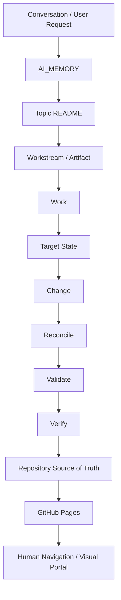

# Second-Brain Knowledge Portal

Second-Brain is a provider-independent AI working-context layer. The repository remains the source of truth; this site is only a presentation and navigation layer.

## System

- [AI Memory](../AI_MEMORY.md)
- [Workflow](../WORKFLOW.md)
- [Repository Contract](../REPOSITORY_CONTRACT.md)
- [Repository README](../README.md)

## Navigation

The authoritative topic registry lives in `AI_MEMORY.md`. Topic content remains under `TOPICS/`.

## Visual architecture

GitHub Pages does not create a second source of truth. Changes must be made in the repository and then reflected here through the normal publishing flow.
